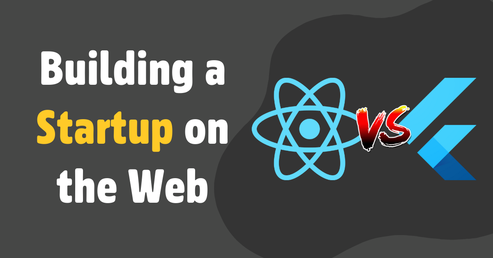

Flutter for web has evolved significantly in the past few years and in this post I wanted to give a comprehensive comparison between using Flutter vs React for developing web apps specifically. I've used both [Flutter and React for startups](how-i-reached-50k-users-with-flutter.md) so I have a good sense of both. 

Anyways, the most important thing in startups is iteration speed. The ability to quickly build a product, get customer feedback, and iterate is the thing that sets apart the good startups and the dead startups. Now in my opinion, a good framework (for startups), is one that enables you to iterate as fast as possible. With that knowledge, let's dive into why I think Flutter wins in almost all aspects.

<!-- truncate -->

## Development Experience
Flutter makes the dev life a breeze. Forget the headache of constant null checks, too many variables, and scratching your head over whether an empty array is truly empty. Dart’s tooling is just the cherry on top, making Flutter my go-to for a smooth coding experience.

✅ Flutter |  ❌ Javascript
## Setup Time
Flutter is incredibly self-sufficient, providing a wealth of packages right out of the box. This eliminates the need for extensive research on UI libraries or the necessity of third-party libraries for basic functionalities. The ease of access to these tools significantly accelerates the development, allowing for fast iteration cycles.

✅ Flutter |  ❌ Javascript
## Transitioning to Mobile
Although, we are comparing web frameworks, it's also important to note the ability to transition to a native mobile app. Mobile is becoming increasingly prevalent and users are not as tolerant with using web apps on their phone. With React, there is no easy way to transition to mobile and it comes with the logistical nightmare of managing separate codebases for different platforms. This is another easy win for Flutter.

✅ Flutter |  ❌ Javascript
## SEO and Initial Load Speeds
Although not directly related to web apps, I wanted to bring SEO up because this is a contentious topic. React 100% takes this because Flutter is NOT built for static web pages. It has slow initial loading speeds and bad SEO. Now this begs the question: how does this affect my startup iteration speed?

It doesn't.

If you're building a startup, it's much faster to use a no-code landing page builder (e.g. [Framer](solopreneur-saas-toolkit-my-tech-stack-as-a-former-cto-of-a-yc-backed-startup.md)) to build your landing page. Then the landing page can have a call to action which will lead the user into clicking to the app. 

❌ Flutter |  ✅ Javascript
## Hiring
Some people worry that finding developers who know how to use Flutter might be hard because it's pretty new. This makes sense since not a lot of people have had the chance to learn Flutter yet.

But from what I've seen, it's not a big problem. Flutter is easy to learn and use. I once hired a college intern who only knew how to use React, and guess what? They were able to contribute to our Flutter projects after one week of onboarding.

So, if you're thinking of hiring someone, you don't need to find someone who only knows Flutter. Oftentimes, someone who knows JavaScript (a common programming language) can learn Flutter quickly and do a great job. 

❌ Flutter |  ✅ Javascript

## In Summary

| Feature                  | Flutter | React |
| ------------------------ | ------- | ----- |
| Development Experience   | ✅       | ❌     |
| Setup Time               | ✅       | ❌     |
| Transitioning to Mobile  | ✅       | ❌     |
| SEO / Initial Load Speed | ❌       | ✅     |
| Hiring                   | ❌       | ✅     |
| Performance              | ❌       | ✅     |
