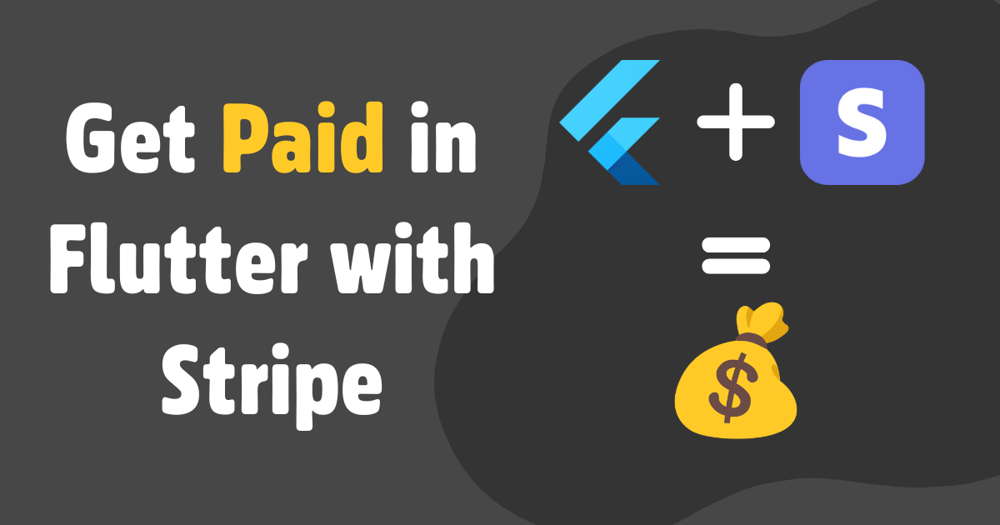

This is my guide on the fastest way to get paid with Stripe and Flutter. I'll walk through step-by-step instructions on how I set up stripe integration, how I associate purchases (subscriptions & one-time payments) with users, and how I keep track of all of that within Supabase. Afterwards, I'll talk about the review process and how to tip-toe around the strict AppStore rules. 

<!-- truncate -->

## Stripe + Supabase Integration

Stripe has a lot of built-in complexity to handle many edge cases. But at the end of the day, what's most important on the Supabase side is to know which user purchased what product or whether or not they are subscribed. My approach to this is to have an `active_products` column that is synced with Stripe and keeps track of the users' purchased products and products they are currently subscribed to. I also take advantage of Stripe's checkout portal so I don't need to create the payment UI myself.
### User Payment Flow
1. User creates an account (through Supabase)
2. The user goes to the pricing page and selects a payment option
3. The link redirects them to the Flutter app with the price id from Stripe
4. A function is called from the Flutter app which creates a custom checkout portal link
5. The user is redirected to the stripe portal link and makes the purchase
6. A stripe webhook is triggered which updates `active_products`
7. After the purchase, the user is redirected back to the app
8. The app now knows the user's purchases through the stripe table
### Setup
1. To get things started, you'll need to set up a [Stripe](https://stripe.com/en-ca) account and a [Supabase](https://supabase.com/) account. 
2. Run the following SQL commands to create a read-only Stripe table in Supabase
```sql
-- create stripe table
create table
public.stripe (
user_id uuid not null,
updated_at timestamp with time zone not null default now(),
stripe_customer_id text null,
created_at timestamp with time zone not null default now(),
active_products text[] not null default '{}'::text[],
constraint user_metadata_pkey primary key (user_id),
constraint customers_stripe_customer_id_key unique (stripe_customer_id),
constraint stripe_user_id_fkey foreign key (user_id) references auth.users (id) on delete cascade
) tablespace pg_default;

-- keep updated_at row up to date
create trigger handle_updated_at before
update on stripe for each row
execute function moddatetime ('updated_at');

-- add row-level security
create policy "authenticated users can only see their data"
on "public"."stripe"
as permissive
for select
to authenticated
using ((auth.uid() = user_id));
```
3. Create two Supabase functions, one to [generate a checkout link](https://github.com/devtodollars/startup-boilerplate/blob/main/supabase/functions/get_stripe_url/index.ts) and another to [handle stripe webhooks](https://github.com/devtodollars/startup-boilerplate/blob/main/supabase/functions/stripe_webhook/index.ts).
4. After deploying the functions, [connect the webhook with Stripe](https://docs.stripe.com/webhooks#add-a-webhook-endpoint) and send the following events: `customer.subscription.deleted`, `customer.subscription.updated`, `customer.subscription.created`, `checkout.session.completed`
5. Enable, the [checkout portal](https://dashboard.stripe.com/settings/billing/portal) in stripe by clicking "Save Changes".
6. Now in your Flutter app, you can call the checkout function to [generate a link](https://github.com/devtodollars/startup-boilerplate/blob/main/flutter/lib/services/auth_notifier.dart#L105) so the user can begin their checkout
7. Finally, you can make a [simple query](https://github.com/devtodollars/startup-boilerplate/blob/main/flutter/lib/services/auth_notifier.dart#L57) to check whether or not the user is subscribed

If you're also interested in setting up analytics, transactional emails, release pipelines, or just want to play around with the demo, I encourage you to check out my [open-source flutter production boilerplate](https://github.com/devtodollars/startup-boilerplate). It has everything you need to build your startup.
## Tip Toeing the Android and Apple App Store
So now you have Stripe set up with the checkout portal and webhooks in place, the payment process should work for web apps. But, the [Apple App Store](https://developer.apple.com/app-store/review/guidelines/#in-app-purchase) and [Google Play Stores](https://support.google.com/googleplay/android-developer/answer/10281818?hl=en#zippy=%2Ccan-i-distribute-my-app-on-other-android-app-stores-or-my-website) have strict guidelines on what can and cannot be done. There are ways to tiptoe around these guidelines. For example, apps like Netflix, Spotify, and Audible use this approach to circumvent the huge 30% commission Apple has. For us, we do it because it's a hassle to integrate with the respective app stores. 

Here's how these companies do it:
- **Netflix**: You are only able to sign in from the app, you are unable to sign up and pay.
- **Spotify**: When you try to access a premium feature, it directs you to a page that says "You can't upgrade to Premium in the app. We know, it's not ideal."
- **Audible**: When you click "Buy more Credits" you see a current subscription page with text saying "To manage your account, visit the Audible site or call customer support"

Depending on what type of app you have and what business model you are using you can try one of the approaches above. Below are additional tips to help get you approved:
- Do not mention payments within the app and remove all links to the pricing page. I use the `kIsWeb` flag (or Platform flags) to hide payment stuff in Flutter.
- Remove your paywalls, and direct the user to a page to tell them to manage their account on the web. Use wording similar to Spotify or Audible. 

## Additional Options:
Depending on your app sometimes, it doesn't make sense to tip-toe around the app store. Below is a pros and cons table to help you figure out which solution is the best for you. I either recommend using Stripe or RevenueCat, it doesn't make sense to do a self-implementation of this.

|                         | Pros                                                                              | Cons                                                                                                                      |
| ----------------------- | --------------------------------------------------------------------------------- | ------------------------------------------------------------------------------------------------------------------------- |
| **Stripe**              | Lower Fees, All payments done in Stripe, Unified Analytics                        | More hoops for the user to jump through in order to pay                                                                   |
| **RevenueCat**          | Higher Conversion Rates, No need to handle syncing the backend, Unified Analytics | Web implementation requires Stripe regardless, Higher fees with Revenue Cat, App Store, and Play Store, Longer setup time |
| **Self Implementation** | Higher Conversion Rates, Circumvent RevenueCat Fees                               | Requires you to create webhooks and backend sync for Stripe/App Store/Play Store, No unified analytics out of the box     |


**Note**: You can sign up for Apple's [small business program](https://developer.apple.com/app-store/small-business-program/) to only get charged 15% commission fee instead of 30%
