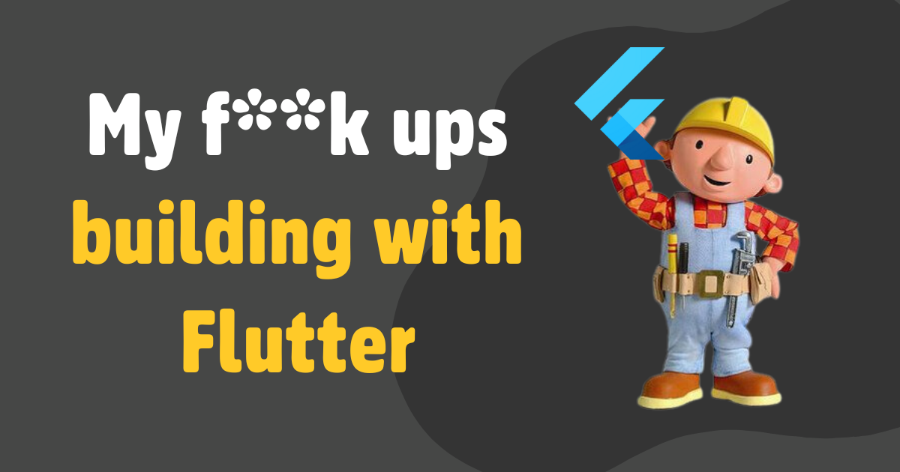

I wanted to share my mistakes to show you that building a SaaS can be messy, especially when you're still learning. These were short-term errors, but I quickly learned from each experience and became a better developer because of it. I hope this inspires you guys to go out there and build something!

Right now, the app brings in roughly $800 per month, with most of that money coming in as profit. I'm putting it on maintenance mode for now while I focus on my next venture: helping developers become founders.

<!-- truncate -->
## 1. Didn't Start with Flutter
My first "f\*\*k up" is that I didn't start with Flutter. Coming from React, I thought React Native would be the perfect solution. I dove straight in and spent a month discovering that web integration was not ideal, performance was painful to deal with, and everything
was hard to set up. Switching to Flutter was a breath of fresh air, and I realized I should have done it from the start, considering my needs (web, desktop, mobile app).

## 2. No State Management
I'm ashamed to admit that I started building the app without any state management in place. Instead, I chose to pass variables through multiple layers of the widget tree. This approach taught me the importance of state management firsthand. Eventually, I migrated
to [Riverpod](flutter-riverpod-is-not-complicated.md) and learned why it's essential for any Flutter project. Looking back at my early code, I cringe at the mistakes I made – a valuable lesson in the power of state management!

## 3. Multiple DB migrations
I started with MongoDB (Realm) for its offline support capabilities. However, I soon needed web support, which wasn't ideal. So, I switched to Firebase, which worked well until I encountered issues with limited native Dart support, slow build times, workarounds that left me uneasy, and no desktop support.

Finally, I [settled on Supabase](https://www.fleetingnotes.app/posts/migrating-from-firebase-to-supabase), which met all my needs except for the lack of offline support. To address this gap, I opted to build a custom offline sync solution. While Fleeting Notes is still powered by Supabase to this day, the migration process was undoubtedly painful.

## 4. Built Too Much, Too Soon
Initially, this app was meant to be a simple capture platform for Obsidian users. However, I got carried away and built too many features that didn't align with my core purpose. Features like full offline support, end-to-end encryption, and an entire mobile app were
not necessary for the first version of the product. What mattered most was a quick capture interface and seamless Obsidian sync.

If I had to do it again, I'd likely focus on email or text as the primary means of capture. This would mean concentrating solely on the backend and Obsidian sync components. Then, based on customer feedback, I could potentially develop an app if needed.

## What I'm Up to Now?
I created this post with the hopes of inviting you to join my Discord community. This space is designed to help developers like yourselves become founders. Within our community, you'll find valuable resources and opportunities, including:

* Weekly office hours for personalized guidance
* Exclusive hackathons to foster innovation
* Startup and tech support to overcome common challenges
* Co-founder matching opportunities to connect with like-minded individuals

Join here: https://discord.gg/8c23C33c47
