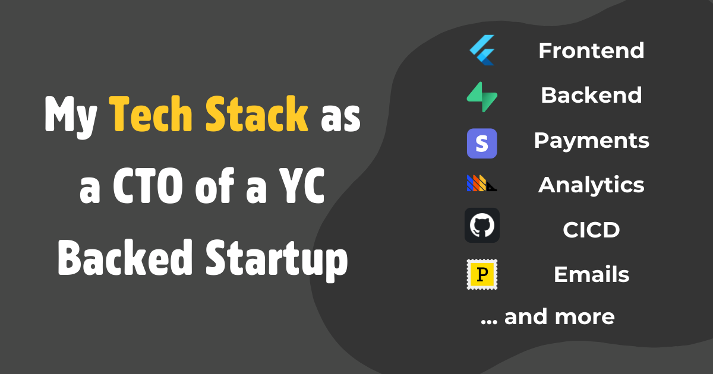

Hi! My name is Matt. I'm a former CTO of a YC backed startup and I've built 2 apps in the past that have both generated over $10K USD of revenue.

Before moving onto my third startup, I wanted to take a step back, reflect on what I've done and create a good base for future startups. Which is why I've decided to write down my tech stack and create some boilerplate code for my future startups. I hope sharing this can help you build your startup!

[Github Boilerplate Code](https://github.com/devtodollars/flutter-supabase-production-template)

<!-- truncate -->

**Development**

* Frontend ([Flutter](why-flutter-is-the-best-framework-for-startups.md))
  * State Management ([riverpod](https://pub.dev/packages/riverpod))
  * Routing ([go\_router](https://pub.dev/packages/go\_router))
* Backend ([Supabase](https://supabase.com/))
  * Backend Functions ([Deno](https://supabase.com/docs/guides/functions))
  * Database ([PostgreSQL](https://supabase.com/docs/guides/database/overview))
* Payments ([Stripe](https://stripe.com/))
* Generative AI ([OpenAI](https://openai.com/))
* Documentation ([Gitbook](https://www.gitbook.com/))

**DevOps**

* CICD ([Github Actions](https://github.com/features/actions))
* Project Planning ([Github Projects](https://docs.github.com/en/issues/planning-and-tracking-with-projects/learning-about-projects/about-projects))
* Code Management ([Github](https://github.com/))

**Design & UX**

* Landing Page ([Framer](https://framer.com/projects/))
* Design ([Canva](https://www.canva.com/))

**Analytics & Monitoring**

* Analytics ([Posthog](https://posthog.com/))
* Error Monitoring ([Sentry](https://sentry.io/welcome/))

**Communications & Marketing**

* Email API / SMTP ([Postmark](https://postmarkapp.com/))
* Help Desk ([Intercom](https://www.intercom.com/))
* Community Management ([Discord](https://discord.com/))

**Productivity & Collaboration**

* Quick Notes ([Apple Notes](https://apps.apple.com/ca/app/notes/id1110145109))
* Notes & Documentation ([ObsidianMD](https://obsidian.md/))
* Personal Task Management ([Motion](https://www.usemotion.com/))
* Meetings ([Google Meets](https://meet.google.com/))
* Emails ([Superhuman](https://superhuman.com/))

**Infrastructure & Hosting**

* Web App Host ([Netlify](https://www.netlify.com/))
* Domain Management ([Cloudflare](https://www.cloudflare.com/))

**Tools & Utilities**

* IDE ([iTerm2](https://iterm2.com/) / [AstroNvim](https://astronvim.com/))
* Password Manager ([1Password](https://1password.com/))
* Digital Workspace ([Google Workspace](https://workspace.google.com/intl/en\_ca/))
* Video Editing ([Descript](https://www.descript.com/))
* Quick Video Recording ([Screen Studio](https://www.screen.studio/))

**Personal Setup**

* Computer (M1 Macbook Pro 14")
* Browser ([Arc](https://arc.net/))
