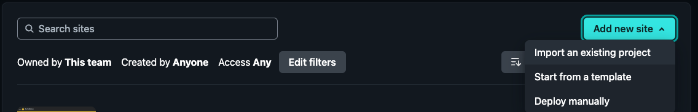

# Landing (Docusaurus)
I chose [Docusaurus](https://docusaurus.io/) because I wanted a customizable documentation website that where I can use [Github](https://github.com) and [markdown](https://www.markdownguide.org/) as my CMS. Other solutions I found weren't customizable enough and/or didn't have the built-in SEO (e.g. blog or documentation) I needed.

## Setup Docusaurus
By the end of this setup you will have a deployed version of docusaurus.
1. Click `Use this template` in the [boilerplate repository](https://github.com/devtodollars/startup-boilerplate). This repository is where the publishing will occur.
2. Once you've cloned the repository head over to [Netlify](https://netlify.com) > Add New Site > Import an existing project

3. Select `Deploy with Github` and select the repository you just created
4.  Set the base directory, build command, and publish directory as seen below.

4. Click "Deploy" and wait for your site to be published!

