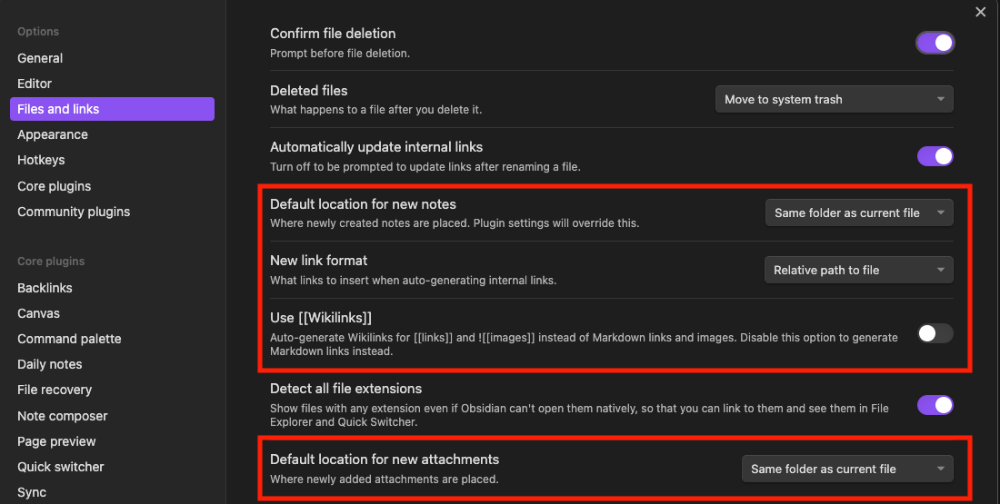

# Setup Obsidian as Docusaurus CMS
1. Install [Obsidian](https://obsidian.md/)
2. Go to Settings > Files and links, then update the following settings:

3. Install the [Obsidian Git](https://github.com/denolehov/obsidian-git/wiki/Installation) community plugin
:::info
If you don't know how to setup `git`, I encourage you to checkout my video on how to setup Obsidian and Git:
https://www.youtube.com/watch?v=5YZz38U20ws
:::
4. Run the command (CMD/Ctrl + P): `Clone an existing remote repo` and paste the remote repository url
5. Restart Obsidian
6. Make edits to your notes
7. Run the command `Obsidian Git: Create backup` by opening the command palette (CMD/Ctrl + P) to publish your notes
